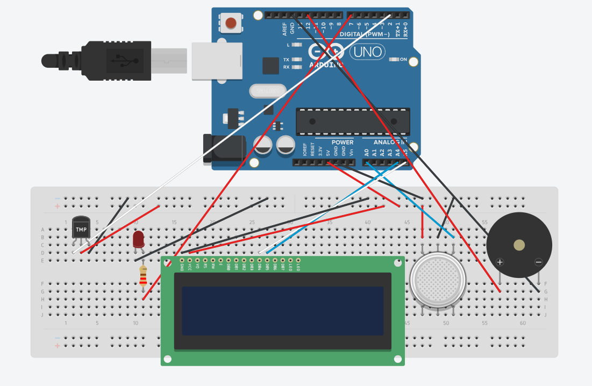
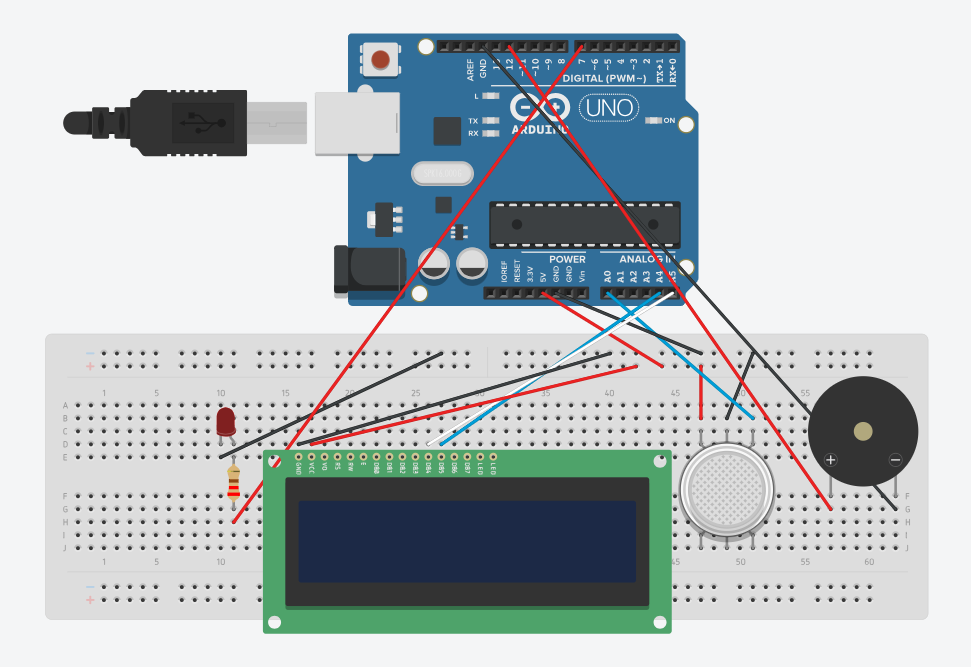
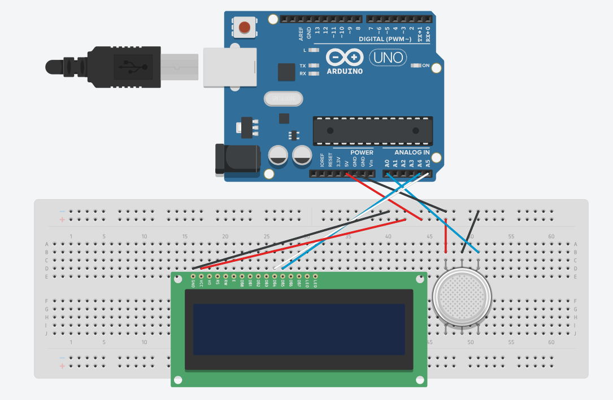

# Air Quality Monitor with Temperature and Humidity Module and Active Buzzer and LED Alert System
My project is an Air Quality Monitor that includes a temperature and humidity module, an OLED display to communicate to the user, and an LED and buzzer alert system for unhealthy air quality. This project was a challenge to finish because of my limited time to complete deliverables,  I would reccomend this program to anyone interested in engineering, no matter how new you are.

| **Engineer** | **School** | **Area of Interest** | **Grade** |
|:--:|:--:|:--:|:--:|
| Ryan M | Los Gatos High School | Electrical, Mechanical, Software Engineering | Incoming Sophomore


  
# Final Milestone
For my final milestone, my project ended successfully. Since my previous milestone, I added on a DHT11 Temperature and Humidity Module. I wrote code to display the values given back by the DHT11 on the OLED display, and in the product's loop, it now successfully displays Temperature in Celsius, Air Humidity, and Air Quality in PPM. Overall this was an amazing experience and has grown my passion for engineering immensely.

<iframe width="560" height="315" src="https://www.youtube.com/embed/bJ6vqKTBas0" title="YouTube video player" frameborder="0" allow="accelerometer; autoplay; clipboard-write; encrypted-media; gyroscope; picture-in-picture; web-share" allowfullscreen></iframe>

# Second Milestone
For my second milestone, I learned about different commands in Arduino, and modified my product with an active buzzer and an LED, both of which activate when the if command comes back true. Since this was my first experience with if commands, the active buzzer and LED were somewhat simple to include because their code was at my disposal already. Going into my final milestone, I'll need to add a temperature and humidity module, and make sure all of my code is working correctly and there's no issues with the MQ135 library like previously.

<iframe width="560" height="315" src="https://www.youtube.com/embed/QO_ijwA-JwU" title="YouTube video player" frameborder="0" allow="accelerometer; autoplay; clipboard-write; encrypted-media; gyroscope; picture-in-picture; web-share" allowfullscreen></iframe>

# First Milestone
For my first milestone, I experimented with and learned about all the parts included in the Super Starter Kit. Since this was my first experience with coding and using a breadboard, I spent a significant amount of time learning about the code and how to use the breadboard. The goal of my first milestone was to complete the base product, and I did that. I completed my build of an MQ135 air quality monitor with an OLED display, and troubleshot coding issues regarding resistor variable values in the MQ135 to finalize the code. A challenge I'm sure I will face in future milestones is that I will have to be careful when combining the code for different parts like the LED and Active Buzzer with the code for the base AQ monitor. I'm sure this will pose a challenge for me. My plan for the second milestone is to have somewhat of a working prototype for my final product, with an LED and Active Buzzer connected to the base product and somewhat working.

<iframe width="560" height="315" src="https://www.youtube.com/embed/j5LZdaHLu88" title="YouTube video player" frameborder="0" allow="accelerometer; autoplay; clipboard-write; encrypted-media; gyroscope; picture-in-picture; web-share" allowfullscreen></iframe>

# Schematics 
Milestone 3 Final Schematic (Base Product + LED/Buzzer/Temp and Humidity Module)



Milestone 2 Schematic (Base Product + LED/Buzzer)



Milestone 1 Schematic (Base Product)



Schematics Notes:
Tinkercad did not have a lot of the parts I used, so I did my best to replace them with the parts it had. The Temperature Sensor in the schematic is actually the DHT11 Temperature and Humidity Module, which is why the pins are rearranged (power and data pin are switched), the Gas Sensor is the MQ135 Air Quality Module (ignore the bottom three pins on the gas sensor), and the large OLED display is actually a smaller OLED display with only four pins that connect to analog pins on the Arduino, which is why there is only four connected in the schematic. Also, the piezo is the active buzzer, and the setup of the actual product is a little bit different than the schematic.
# Final Code
```c++
#include <SPI.h>
#include <Wire.h>
#include <Adafruit_GFX.h>
#include <Adafruit_SSD1306.h>
#include <dht_nonblocking.h>
#include "MQ135.h" // For MQ135
const int ANALOGPIN=0; // For MQ135
MQ135 gasSensor = MQ135(ANALOGPIN); // For MQ135 
int buzzer=12;
int LED=7;
static const int DHT_SENSOR_PIN = 2;
#define DHT_SENSOR_TYPE DHT_TYPE_11
DHT_nonblocking dht_sensor( DHT_SENSOR_PIN, DHT_SENSOR_TYPE );

#define SCREEN_WIDTH 128 // OLED display width, in pixels
#define SCREEN_HEIGHT 64 // OLED display height, in pixels

// Declaration for an SSD1306 display connected to I2C (SDA, SCL pins)
// The pins for I2C are defined by the Wire-library. 
// On an arduino UNO:       A4(SDA), A5(SCL)
// On an arduino MEGA 2560: 20(SDA), 21(SCL)
// On an arduino LEONARDO:   2(SDA),  3(SCL), ...
#define OLED_RESET     -1 // Reset pin # (or -1 if sharing Arduino reset pin)
#define SCREEN_ADDRESS 0x3C ///< See datasheet for Address; 0x3D for 128x64, 0x3C for 128x32
Adafruit_SSD1306 display(SCREEN_WIDTH, SCREEN_HEIGHT, &Wire, OLED_RESET);

void setup() {
  pinMode(buzzer,OUTPUT);
  pinMode(LED,OUTPUT);
  Serial.begin(9600);

  // SSD1306_SWITCHCAPVCC = generate display voltage from 3.3V internally
  if(!display.begin(SSD1306_SWITCHCAPVCC, SCREEN_ADDRESS)) {
    Serial.println(F("SSD1306 allocation failed"));
    for(;;); // Don't proceed, loop forever
  }
}
static bool measure_environment( float *temperature, float *humidity )
{
  static unsigned long measurement_timestamp = millis( );

  /* Measure once every four seconds. */
  if( millis( ) - measurement_timestamp > 1000ul )
  {
    if( dht_sensor.measure( temperature, humidity ) == true )
    {
      measurement_timestamp = millis( );
      return( true );
    }
  }

  return( false );
}
void loop() {
  float temperature;
  float humidity;
  if( measure_environment( &temperature, &humidity ) == true )
  {
    Serial.print( "T = " );
    Serial.print( temperature, 1 );
    Serial.print( " deg. C, H = " );
    Serial.print( humidity, 1 );
    Serial.println( "%" );
  }
  printtextTH(temperature,humidity);
  printtext1();
  delay(1000);
  float ppm = gasSensor.getPPM();
  Serial.println(ppm);
  printtext2(ppm);
  delay(1000);
    if(ppm>1000){
    makesound();
    digitalWrite(LED, HIGH);
    delay(250);
    digitalWrite(LED, LOW);
    delay(250);
    digitalWrite(LED, HIGH);
    delay(250);
    digitalWrite(LED, LOW);
    }
    
}
  void printtextTH(float temperature,float humidity) {
display.clearDisplay();
display.setTextSize(2);
display.setTextColor(WHITE);
display.setCursor(0,10);
display.print("Temp(C)=");
display.print(temperature);
display.display();
delay(1000);
display.clearDisplay();
display.setTextSize(2);
display.setTextColor(WHITE);
display.setCursor(0,10);
display.print("Humidity=");
display.print(humidity);
display.display();
delay(1000);
  }
  void printtext1() {
    display.clearDisplay();
    display.setTextSize(2);
    display.setTextColor(WHITE);
    display.setCursor(0,10);
    display.print("Air Quality=");
    display.display();
  }
  void printtext2(float ppm) {
    display.clearDisplay();
    display.setTextSize(2);
    display.setTextColor(WHITE);
    display.setCursor(20,40);
    display.print(ppm);
    display.display();
  }
  void makesound() {
    unsigned char k;
  digitalWrite(buzzer,HIGH);
  delay(100);
  digitalWrite(buzzer,LOW);
  delay(100);
  digitalWrite(buzzer,HIGH);
  delay(100);
  digitalWrite(buzzer,LOW);
  delay(100);
  digitalWrite(buzzer,HIGH);
  delay(100);
  digitalWrite(buzzer,HIGH);
  delay(100);
  digitalWrite(buzzer,LOW);

 {
   //output an frequency
   for(k=0;k<80;k++)
   {
    digitalWrite(buzzer,HIGH);
    delay(1);//wait for 1ms
    digitalWrite(buzzer,LOW);
    delay(1);//wait for 1ms
    }
    //output another frequency
     for(k=0;k<100;k++)
      {
        digitalWrite(buzzer,HIGH);
        delay(2);//wait for 2ms
        digitalWrite(buzzer,LOW);
        delay(2);//wait for 2ms
      }
 }
 }
```

# Bill of Materials

| **Part** | **Quantity** | **Note** | **Price** | **Link** |
|:--:|:--:|:--:|:--:|:--:|
| Arduino UNO Rev3 | 1 | Write and run code to deliver to connected devices | $28.50 | <a href="https://www.amazon.com/Arduino-A000066-ARDUINO-UNO-R3/dp/B008GRTSV6/"> Link </a> |
|:--:|:--:|:--:|:--:|:--:|
| Solderless Breadboard | 1 | Used to create temporary circuits and to connect electrical components together | $9.99 (3pcs) | <a href="https://www.amazon.com/EL-CP-003-Breadboard-Solderless-Distribution-Connecting/dp/B01EV6LJ7G/ref=asc_df_B01EV6LJ7G?tag=bingshoppinga-20&linkCode=df0&hvadid=80539278509443&hvnetw=o&hvqmt=e&hvbmt=be&hvdev=c&hvlocint=&hvlocphy=&hvtargid=pla-4584138857801087&psc=1"> Link </a> |
|:--:|:--:|:--:|:--:|:--:|
| OLED SSD1306 128x64 LCD Display | 1 | Used to display ppm values detected by air quality monitor | $7.94 | <a href="https://www.walmart.com/ip/0-96-OLED-SSD1306-I2C-IIC-SPI-Serial-128X64-LCD-Display-Gelb-Blau-LCD-5Q8K-C9H1/1079180220?wmlspartner=wlpa&selectedSellerId=101255994&adid=22222222222000000000&wmlspartner=wmtlabs&wl0=e&wl1=o&wl2=c&wl3=10352200394&wl4=pla-1103028060075:aud-813964392&wl5=&wl6=&wl7=&wl10=Walmart&wl11=Online&wl12=1079180220_10001275354&wl14=SSD1306%20128x64%20OLED%20LCD&veh=sem&gclid=9207663575fc180c1add02a50be3edbd&gclsrc=3p.ds&msclkid=9207663575fc180c1add02a50be3edbd"> Link </a>|
|:--:|:--:|:--:|:--:|:--:|
| USB A to B cable | 1 | Connect Arduino to Computer/Power Source | $3.89 | <a href="https://www.amazon.com/Monoprice-6-Feet-24AWG-Plated-105438/dp/B003BXPQF2/ref=sr_1_5?keywords=usb+b+cable&qid=1687461572&sr=8-5"> Link </a> |
|:--:|:--:|:--:|:--:|:--:|
| MQ135 Air Quality Module | 1 | Take readings of the air and send back results in ppm to serial monitor | $4.00 | <a href="https://www.amazon.com/Generic-Quality-Hazardous-Detection-PromotionHot/dp/B0BQJ1S5W8/ref=sr_1_5?crid=1B0IKO8NDWSJS&keywords=MQ135&qid=1687461870&s=hi&sprefix=mq135%2Ctools%2C187&sr=1-5"> Link </a> |
|:--:|:--:|:--:|:--:|:--:|
| M to M Jumper Wires | 13 | Carry electricity across devices and power breadboard | $7.99 (130 pcs) | <a href="https://www.amazon.com/ELEGOO-Solderless-Flexible-Breadboard-Compatible/dp/B09ZQP9LB6/ref=sr_1_5?crid=3RGCMEDTAC3H&keywords=Male+to+male+jumper+wire&qid=1687462127&sprefix=male+to+male+jumper+wir%2Caps%2C165&sr=8-5"> Link </a> |
|:--:|:--:|:--:|:--:|:--:|
| LED | 1 | Produce Light (a warning that air quality is bad) | $0.18 | <a href="https://www.superbrightleds.com/5mm-red-led-60-degree-viewing-angle-1500-mcd-rl5-rd1560?campaign=BING%20-%20General%20Shopping%20Campaign&adgroup=Bing%20General%20Shopping%20Adgroup&msclkid=5e4649db5c721e91fc892d4ff92d1829&utm_source=bing&utm_medium=cpc&utm_campaign=BING%20-%20General%20Shopping%20Campaign&utm_term=4577541789653860&utm_content=Bing%20General%20Shopping%20Adgroup"> Link </a> |
|:--:|:--:|:--:|:--:|:--:|
| 220-Ohm Resistor | 1 | Limit electrical current flowing to LED to prevent burnout | $5.49 (100 pcs) | <a href="https://www.amazon.com/EDGELEC-Resistor-Tolerance-Resistance-Optional/dp/B07HDGF48W/ref=sr_1_4?crid=F4MSU3SCBEXJ&keywords=220+ohm+resistor&qid=1687463547&s=industrial&sprefix=220ohm+resisto%2Cindustrial%2C155&sr=1-4"> Link </a> |
|:--:|:--:|:--:|:--:|:--:|
| F to M Jumper Wires | 2 | Used to connect the active buzzer to the Arduino | $7.98 (120 pcs) | <a href="https://www.amazon.com/EDGELEC-Breadboard-1pin-1pin-Connector-Multicolored/dp/B07GD1TFBR/ref=asc_df_B07GD1TFBR?tag=bingshoppinga-20&linkCode=df0&hvadid=80470599120789&hvnetw=o&hvqmt=e&hvbmt=be&hvdev=c&hvlocint=&hvlocphy=&hvtargid=pla-4584070145005281&th=1"> Link </a> |
|:--:|:--:|:--:|:--:|:--:|
| Active Buzzer | 1 | Make noise (a warning that air quality is bad) | $7.79 (20 pcs) | <a href="https://www.amazon.com/HiLetgo-Integrated-Sounder-Speaker-Electromagnetic/dp/B09L4M84M9/ref=sr_1_1_sspa?keywords=active+buzzer&qid=1687464027&sr=8-1-spons&sp_csd=d2lkZ2V0TmFtZT1zcF9hdGY&psc=1"> Link </a> |
|:--:|:--:|:--:|:--:|:--:|
| DHT11 Temperature Humidity Sensor Module | 1 | Measure the surrounding air's temperature and humidity | $7.99 (5 pcs) | <a href="https://www.amazon.com/JESSINIE-DHT11-Temperature-Environmental-Induction/dp/B0BLGZN1P4/ref=sr_1_17_sspa?adgrpid=1335907190792181&hvadid=83494440368005&hvbmt=bp&hvdev=c&hvlocphy=86043&hvnetw=o&hvqmt=p&hvtargid=kwd-83494540054072%3Aloc-190&hydadcr=19937_13386698&keywords=dht11+humidity+and+temperature+sensor&qid=1687464135&sr=8-17-spons&sp_csd=d2lkZ2V0TmFtZT1zcF9tdGY&psc=1"> Link </a> |
|:--:|:--:|:--:|:--:|:--:|

# Other Resources/Examples
- [MQ135 Code and Setup Help](https://steemit.com/utopian-io/@cha0s0000/arduino-basics-tutorials-use-mq135-air-quality-detecting-module)
- [Coding Help for Milestone 1](https://arduino.stackexchange.com/questions/26832/how-do-i-convert-a-float-into-char)
- [Understanding OLED Display](https://www.youtube.com/watch?v=rxjIXVwgY50)
